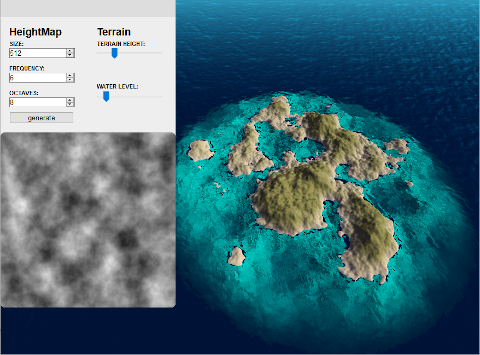

# MatTerrainGen

#### Try a live demo at [terrain.thestaticcow.dk](http://terrain.thestaticcow.dk)

### Purpose

I made this project as an exercise in using Rust together with Webassembly for fast perlin noise generation on the web. The tool generates a variety of different terrain from the availible settings.

### Briefly how it works

The terrain is rendered using ThreeJS. The terrain geometry is drawn entirely in the vertex shadter, such that the true geometry never has to change. The heightmap is only passed to the shader when the terrain changes.

The heightmap is generated using my rust implementation of perlin noise, which can be seen [here](https://github.com/math132d/rust_perlin). The javascript is responsible for passing arguments to webassembly, along with a reference to a mutable buffer which webassembly then writes the new terrain data into. When the terrain has been generated the javascript then draws it into the canvas seen on the left side of the screen, and the heightmap is updated in the shader.
